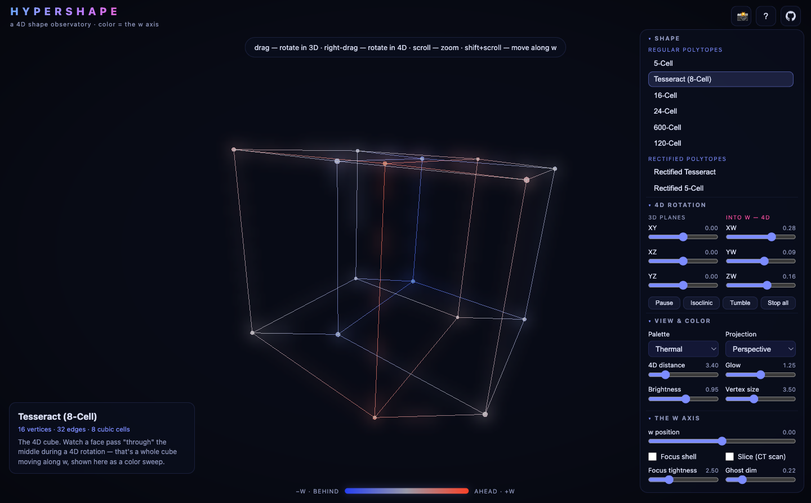
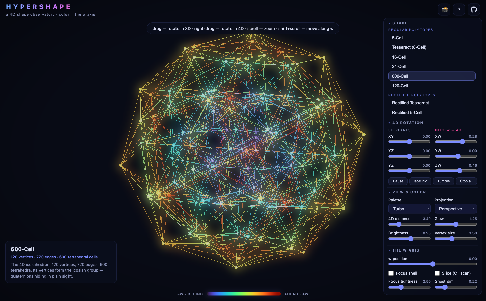
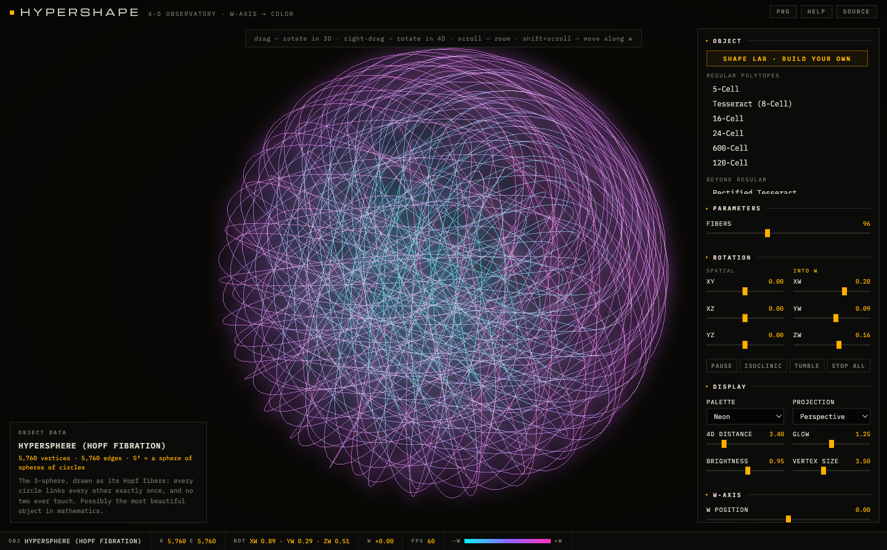
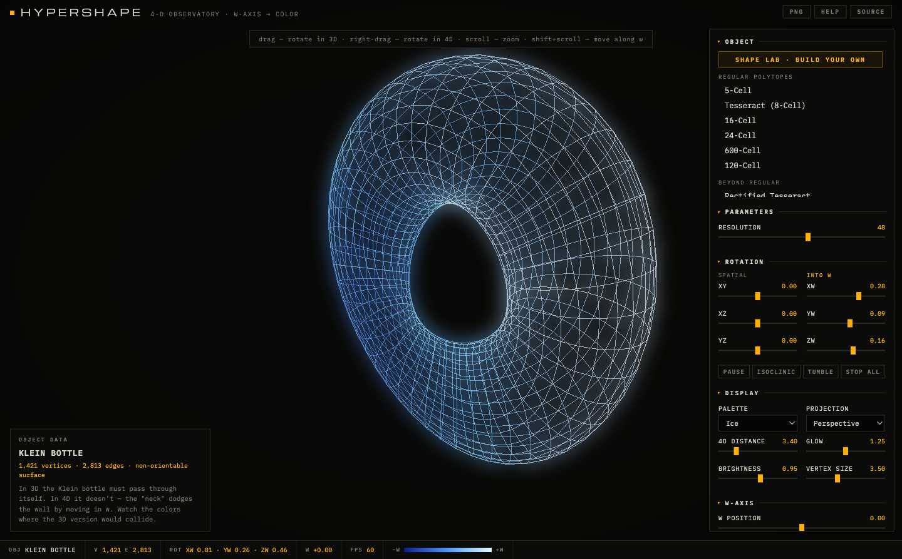
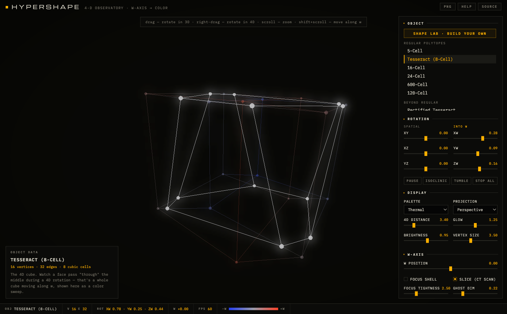
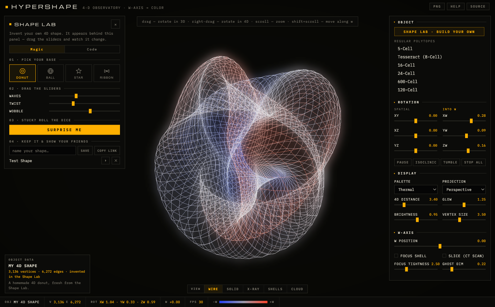

<div align="center">

# 🔮 HYPERSHAPE

### a 4D shape observatory 

### my brain is shifting to see in the 4th dimension guys

**[▶ Live demo](https://mowke.github.io/HYPERSHAPE/)** · zero dependencies · pure WebGL2 · MIT



</div>

Every point of a 4D object has coordinates **(x, y, z, w)**. Your screen can show three of them — so Hypershape draws the fourth one as **color**. Blue means "behind you" in the 4th dimension, red means "ahead". When a shape rotates through a 4D plane, you don't see it turn — you see geometry **flow through the color spectrum** as it moves along an axis that doesn't exist in our space.

## Gallery

| | |
|:---:|:---:|
|  **[600-Cell](https://mowke.github.io/HYPERSHAPE/?shape=600cell)** — 120 vertices, 720 edges, 600 tetrahedral cells |  **[Hopf Fibration](https://mowke.github.io/HYPERSHAPE/?shape=hopf)** — the 3-sphere as linked circles, no two touching |
|  **[Klein Bottle](https://mowke.github.io/HYPERSHAPE/?shape=klein)** — self-intersecting in 3D, clean in 4D |  **[CT-scan slicing](https://mowke.github.io/HYPERSHAPE/?shape=tesseract)** — a true 3D cross-section carved from the hyperplane w = w₀ |

## The shape library

**38 shape families, hundreds of shapes via live parameters:**

- **All six regular 4-polytopes** — 5-cell, tesseract, 16-cell, 24-cell (the one with no 3D analogue), 600-cell, and the 1200-edge 120-cell
- **Beyond regular** — rectified and truncated polytopes, the snub 24-cell, the tesseract⁠+⁠16-cell dual compound, and the **grand antiprism** (the 600-cell minus two perpendicular vertex rings — the strangest uniform polytope, only discovered in 1965)
- **Prisms & products** — the p×q duoprism family (every combination 3–16 × 3–16), plus tetrahedral / octahedral / icosahedral / dodecahedral prisms
- **Curved manifolds** — the Hopf fibration of the 3-sphere, the Clifford flat torus, the Klein bottle's true embedding, the real projective plane (non-orientable, impossible in 3D), the **tiger** (yes, that's its real name), the glome drawn as latitude shells, the spherinder, the hypercone
- **Riemann surfaces** — the graphs of √z, log z, z², z³, 1/z, eᶻ, sin z, and the Joukowski airfoil map z + 1/z live in ℝ⁴ = ℂ²; multi-valued sheets that must self-intersect in 3D pass by cleanly here, separated only by color
- **4D curves** — (p,q) torus knots, 4-frequency Lissajous knots, and the irrational winding that circles the Clifford torus forever without ever closing

## 🧪 The Shape Lab — invent your own



Click **✨ Make your own shape!** in the app and you get a workspace with two modes:

**🪄 Magic mode — no code, kid-approved.** Four steps:
1. **Pick a base** — 🍩 Donut, 🔮 Ball, 💫 Star, or 🎀 Ribbon
2. **Drag the sliders** — waves, twist, wobble, points; the shape reshapes *instantly*
3. **Stuck? Press 🎲 Surprise me!**
4. **Name it, save it, copy the link** — the whole recipe packs into the URL, so your creation opens on anyone's screen

**👩‍💻 Code mode — for when you want the real thing.** Write a tiny builder using the same helpers the built-in library uses, press ▶ Run:

```js
// Two circles in perpendicular planes.
// In 4D they link through each other without ever touching!
const ringA = paramCurve(t => [Math.cos(t), Math.sin(t), 0, 0], { n: 64 });
const ringB = paramCurve(t => [0, 0, Math.cos(t), Math.sin(t)], { n: 64 });
return merge(ringA, ringB);
```

The rules fit in one sentence: *a shape is a list of `[x, y, z, w]` points plus edges connecting them — return `{ verts, edges }` and the renderer does the rest.* Helpers do the heavy lifting: `minDistEdges` auto-connects every closest pair (that rule alone rebuilds most polytopes), `gridSurface` weaves parametric sheets, `paramCurve` draws glowing threads, `merge` glues pieces together, and `triCliques` adds faces so the CT-scanner can slice your creation. Five loadable examples walk you from "connect the dots" to complex-function graphs. Shared code links are never auto-run — recipients see the code first and press Run themselves.

## Controls

| Input | Action |
|---|---|
| drag | rotate the 3D view |
| **right-drag** | **rotate into the 4th dimension** (XW / YW planes) |
| scroll | zoom |
| shift + scroll | move along the w axis |
| space | pause rotation · `R` reset · `S` screenshot · `←`/`→` cycle shapes |

Six independent rotation-speed sliders (one per plane), five color palettes, perspective/orthographic 4D projection, a **focus shell** that fades away all geometry far from a chosen w, and a **cross-section mode** that cuts the shape with the hyperplane w = w₀ and shows you the true 3D slice — the 4D version of a CT scan.

## How it works

**Rotation.** In 4D, rotation doesn't happen around an axis — it happens in a *plane*. There are six coordinate planes: XY, XZ, YZ (the familiar 3D ones) and XW, YW, ZW (the ones that trade space for w). Set two independent planes spinning at once (try the **Isoclinic** button) and you get a double rotation, a motion with no 3D analogue at all.

**Projection.** A "4D camera" sits at distance *d* along the w axis and projects points to 3D exactly the way a 3D camera projects to a 2D photo: `(x, y, z) · d / (d − w)`. Things nearer in w loom larger. A second, ordinary camera then projects that 3D scene to your screen.

**The GPU pipeline.** A 4D rotation is just a 4×4 matrix — so vertices are uploaded to the GPU once as raw `vec4`s, and each frame sends only one `mat4` uniform. The vertex shader does the 4D rotation, the 4D→3D perspective divide, *and* the w→color lookup. The CPU touches vertices only in cross-section mode. Everything renders with additive blending (order-independent, no depth sorting), then a downsample → separable-Gaussian → composite pass adds the neon bloom. No frameworks, no libraries, no build step — view source and it's all there.

**The shapes.** Regular polytopes are generated from exact coordinates (golden-ratio constructions for the 120/600-cells) with edges found by the closest-pair rule and faces found as 3-cliques of the edge graph; curved manifolds and Riemann surfaces are parametric grids; rectified polytopes are built live by midpointing another polytope's edges.

## Run it

**Web** (the flagship) — it's a static page:

```bash
cd docs && python3 -m http.server 8000
# → http://localhost:8000
```

**Desktop** (Python + ModernGL, translucent level-surface rendering):

```bash
cd desktop
pip install -r requirements.txt
python main.py          # keys 1–9, 0 switch between ten shapes
```

## Project structure

```
docs/                  web app (served by GitHub Pages)
  js/shapes.js           the shape library — every generator
  js/renderer.js         WebGL2 engine: GPU 4D pipeline + bloom
  js/slicer.js           CPU hyperplane cross-sections
  js/math4d.js           4D rotation / projection math
  js/palettes.js         w-axis color maps
desktop/               Python + ModernGL desktop visualizer
```

## Credits

Built by [Samahith Thellakal](https://github.com/MowkE). Companion project to [ThunderRhombus/4DVisualizerQuiz](https://github.com/ThunderRhombus/4DVisualizerQuiz) — a pygame 4D visualizer by a friend that this project trades shapes and ideas with.

MIT licensed. If this made you *feel* the fourth dimension for a second, a ⭐ is appreciated.
